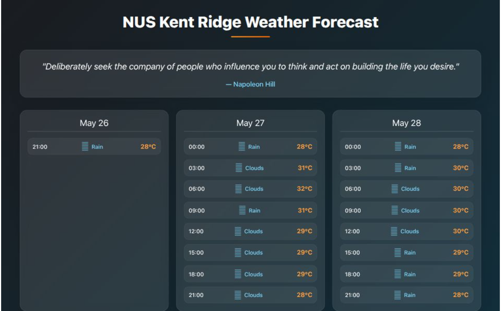

# NUS Kent Ridge Weather Forecast

A beautiful weather forecast application for NUS Kent Ridge campus with daily motivational quotes. The application features a modern, responsive design with a dark theme and glassmorphism effects.

🌐 **Live Demo**: [View the application on Vercel](https://weather-forecast-raiaaa17.vercel.app)
<!---->

## Features

- 🌤️ Client-side weather updates every 3 hours
- 💭 Daily motivational quotes
- 🎨 Modern dark theme with glassmorphism effects
- 📱 Fully responsive design
- 💾 Data caching for better performance
- 🔒 Secure API key handling
- ⚡ Fast loading times
- 🛠️ Error handling and logging

## Tech Stack

- **Backend**: Python, Flask
- **Frontend**: HTML5, CSS3, JavaScript
- **APIs**: OpenWeatherMap, Zen Quotes
- **Deployment**: Vercel

## API Integration

### OpenWeatherMap API
- Used for fetching weather forecast data
- Client-side updates every 3 hours
- Includes temperature, weather conditions, and timestamps
- Automatic refresh when tab becomes visible

### Zen Quotes API
- Provides daily motivational quotes
- No authentication required
- Includes quote text and author

## Error Handling

The application includes comprehensive error handling:
- Custom error pages (404, 500)
- Fallback quotes when API fails
- Weather data caching for offline functionality
- Detailed logging for debugging

## Project Structure

```
nus-weather-forecast/
├── static/
│   ├── css/
│   │   └── style.css
│   └── js/
│       └── weather.js
├── templates/
│   ├── base.html
│   └── index.html
├── app.py
├── weather.py
├── motivation.py
├── requirements.txt
└── README.md
```

## License

This project is licensed under the MIT License - see the [LICENSE](LICENSE) file for details.

## Contact

Rayana Diana - rayanarahadiva@gmail.com

Project Link: [https://github.com/yourusername/nus-weather-forecast](https://github.com/yourusername/nus-weather-forecast) 
